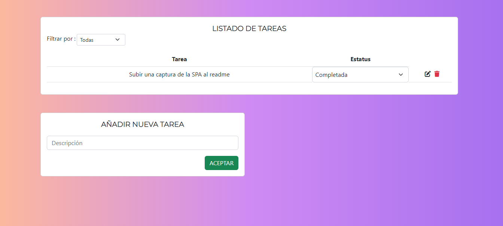

# SPA-ListaDeTareas
SPA Lista de tareas
:computer: Tecnologias usadas:
 -  Mongo DB
 -  Express
 -  Angular 
 -  Node

Para ejecutar correctamente:
 - El frontend se encuentra en la carpeta cliente.
 - El backend se encuentra en la carpeta servidor.
 - Ambos se desarrollaron en Visual Studio Code.
 - Para correr el frontend se debe ejecutar el comando ng serve --o en la terminal.
 - Para correr el backend se debe ejecutar el comando npm run dev en la terminal.
 - Si en el front marca un error sobre el archivo app.component.css , favor de crearlo en la siguiente dirección "cliente/src/app/app.component.css"
 - La base de datos se realizó de forma local en Mongo DB.
 - La SPA permite añadir, editar y eliminar tareas, pero faltó la funcionalidad de filtrar.

